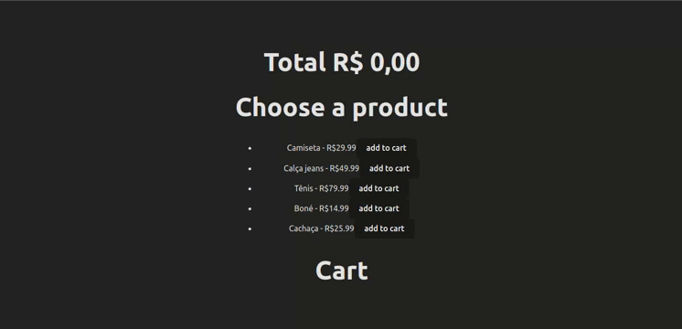

<h1 align="center">
  
</h1>

## :dart: Gerenciando estados com zustand 

O Zustand é uma biblioteca de gerenciamento de estado para React conhecida por sua simplicidade, desempenho eficiente e tamanho pequeno. Ela oferece uma API simples e fácil de entender, mantendo uma excelente performance. O Zustand é flexível o suficiente para lidar com uma variedade de cenários de gerenciamento de estado e pode ser usado de forma independente do React. Em resumo, é uma ótima escolha para projetos React que valorizam simplicidade, desempenho e flexibilidade.

## Objetivo

Este repositório demonstra uma aplicação simples do uso do Zustand para gerenciamento de estados em uma aplicação React. A aplicação consiste em três componentes principais:

- **AvailableProducts:** Exibe uma lista de produtos disponíveis para compra.
- **Cart:** Mostra os itens selecionados pelo usuário para adicionar ao carrinho de compras.
- **Total:** Calcula e exibe o total dos itens no carrinho.
- **CartStore:** Utiliza o Zustand para gerenciar o estado global da aplicação, incluindo os itens no carrinho.

O objetivo deste projeto é fornecer um exemplo claro e conciso de como usar o Zustand para gerenciamento de estados em uma aplicação React, destacando sua simplicidade e eficácia.

--- 

## Demonstração



Estrutura de Pastas:
- `src/`: Contém todo o código-fonte da aplicação.
  - `components/`: Componentes reutilizáveis da aplicação.
    - `AvailableProducts.tsx`: Componente que exibe os produtos disponíveis para compra.
    - `Cart.tsx`: Componente que exibe o carrinho de compras.
    - `Total.tsx`: Componente que exibe o total de compras.
  - `store/`: Contém o código relacionado ao gerenciamento de estado.
    - `CartStore.ts`: Definição e configuração do store usando Zustand.
  - `App.tsx`: Ponto de entrada da aplicação.
- `README.md`: Documentação do projeto, incluindo informações sobre o objetivo, instalação, uso e estrutura do projeto.
- `package.json`: Arquivo de manifesto do Node.js que contém metadados do projeto e as dependências npm.
- `tsconfig.json`: Configuração do TypeScript para o projeto.


## Como Testar o Projeto

Para testar esta aplicação em sua máquina local, siga estas etapas:

1. Clone este repositório em sua máquina local usando o seguinte comando:
```
git clone https://github.com/seu-usuario/nome-do-repositorio.git
```

2. Navegue até o diretório do projeto:
```
cd nome-do-repositorio
```


3. Instale as dependências do projeto usando um gerenciador de pacotes, como npm ou yarn. Se você estiver usando npm, execute:
```
npm install
```


4. Após a instalação das dependências, inicie o servidor de desenvolvimento executando o seguinte comando:

```
npm start
```


5. Abra seu navegador e vá para `http://localhost:3000` para ver a aplicação em execução.

Agora você pode interagir com a aplicação e testar suas funcionalidades.


